# Tarea 4 — Diseño de Microservicios

Este documento describe el diseño preliminar para desacoplar el sistema actual en una arquitectura de microservicios con límites de dominio claros, aislamiento de datos y estrategias de comunicación definidas.

---

## 1. Identificación de los Servicios

Dividimos el sistema en dos servicios con responsabilidades independientes y principio de **Database per Service**:

### Servicio 1: Servicio de Autenticación y Usuarios (`Auth & User Service`)
- **Responsabilidades:**
  - Registro, autenticación y gestión del ciclo de vida de usuarios.
  - Validación de credenciales y políticas de seguridad (contraseñas, intentos fallidos).
  - Emisión, firma y verificación de tokens de acceso (JWT) o revocación de sesiones.
  - Gestión de roles y permisos (ej. `admin`, `cliente`).
- **Persistencia propia:** Base de datos de usuarios (`users_db`). Ningún otro servicio tiene acceso directo a esta base de datos.

### Servicio 2: Servicio de Catálogo de Productos (`Product & Catalog Service`)
- **Responsabilidades:**
  - Gestión completa del catálogo de productos (CRUD: nombre, precio, stock, categorías).
  - Consulta pública y filtros de búsqueda de productos.
  - Verificación y actualización de existencias (stock).
- **Persistencia propia:** Base de datos de catálogo (`products_db`).

---

## 2. Diagrama de Arquitectura y Comunicación

### Diagrama Mermaid

```mermaid
flowchart TD
    Client["Cliente Frontend (SPA React)"]

    subgraph Gateway ["Punto de Entrada"]
        APIGateway["API Gateway / Reverse Proxy"]
    end

    subgraph AuthService ["Auth & User Service"]
        AuthApp["API Auth (Express / Node.js)"]
        AuthDB[("Users DB (MongoDB / PostgreSQL)")]
        AuthApp --- AuthDB
    end

    subgraph ProductService ["Product & Catalog Service"]
        ProdApp["API Products (Express / Node.js)"]
        ProdDB[("Products DB (MongoDB)")]
        ProdApp --- ProdDB
    end

    subgraph EventBroker ["Mensajería Asíncrona (Opcional)"]
        Broker["Message Broker (RabbitMQ / Redis PubSub)"]
    end

    %% Flujos de clientes
    Client -->|"REST / HTTPS"| APIGateway
    APIGateway -->|"POST /login"| AuthApp
    APIGateway -->|"GET, POST, PUT, DELETE /products"| ProdApp

    %% Validación y eventos entre servicios
    ProdApp -.->|"Valida firma JWT (Stateless con clave pública)"| AuthApp
    AuthApp -.->|"Publica eventos (ej: UserDisabled)"| Broker
    Broker -.->|"Consume eventos"| ProdApp
```



### Diagrama en Texto / ASCII

```text
+-------------------------------------------------------------+
|                  Frontend (SPA en React)                    |
+-------------------------------------------------------------+
                               |
                               | HTTPS / REST (JSON)
                               v
+-------------------------------------------------------------+
|             API Gateway / Reverse Proxy (:80/443)           |
+-------------------------------------------------------------+
           |                                       |
  /login   |                                       | /products
           v                                       v
+-----------------------+               +-----------------------+
|  Auth & User Service  |               |  Product & Catalog    |
|       (Puerto 3001)   |               |     (Puerto 3002)     |
+-----------------------+               +-----------------------+
| - Login & JWT Tokens  |               | - CRUD de Productos   |
| - Gestión de Usuarios |               | - Manejo de Stock     |
+-----------------------+               +-----------------------+
           |                                       |
           v                                       v
   [( Users Database )]                   [( Products Database )]
```

---

## 3. Modelo de Comunicación: Síncrona vs. Asíncrona

### Para las peticiones de los Clientes (Frontend $\rightarrow$ Servicios): **Síncrona (REST / HTTP)**
- **Por qué:** El usuario y la interfaz esperan una respuesta inmediata en el flujo de interacción:
  - Al iniciar sesión en el formulario, el cliente necesita recibir sincrónicamente el token JWT o el mensaje de error 401.
  - Al consultar el listado de productos o crear un producto, la interfaz requiere conocer al instante el estado (`200 OK` o `201 Created`) para renderizar la tabla o actualizar la vista.

### Entre Microservicios (Inter-Service Communication):
1. **Validación de Autenticación: Síncrona Descentralizada (Stateless JWT con Clave Pública / Secreto Compartido)**:
   - **Por qué:** Para evitar acoplamiento temporal y cuellos de botella de red, el `Product Service` **no realiza una llamada HTTP al `Auth Service` en cada request**. En su lugar, valida criptográficamente la firma del JWT en memoria. Esto garantiza máxima velocidad y disponibilidad incluso si el servicio de autenticación tuviese una degradación temporal.
2. **Eventos de Negocio: Asíncrona mediante Mensajería (Broker / Event-Driven)**:
   - **Por qué:** Si en el futuro una acción en un servicio impacta al otro (por ejemplo: si un usuario es dado de baja o un rol cambia y se deben revocar permisos sobre productos, o si se añade un servicio de órdenes que descuenta stock), la comunicación debe ser **asíncrona** a través de un Message Broker (como RabbitMQ o Redis Streams). Esto desacopla el ciclo de vida de los servicios: si un servicio receptor está caído temporalmente, el mensaje no se pierde y se procesa cuando vuelva a estar activo.

---

## 4. Impacto de NO Dividir en Servicios al Crecer el Proyecto

Si el sistema continuase como un monolito a medida que el proyecto y el equipo crecen, aparecerían los siguientes problemas críticos:

1. **Acoplamiento de despliegue y riesgo de fallos (Blast Radius):** Cualquier error en una funcionalidad secundaria del catálogo de productos podría dejar inoperativo el módulo de autenticación para todos los usuarios. Para desplegar un cambio mínimo de productos sería necesario compilar, probar y reiniciar todo el sistema completo.
2. **Incapacidad de escalar de forma eficiente y económica:** El catálogo de productos suele recibir un volumen de lecturas significativamente mayor que las operaciones de autenticación (frecuentemente en proporciones superiores a 100:1). En un monolito se debe escalar vertical o horizontalmente toda la aplicación y su única base de datos, mientras que con microservicios se replica únicamente el servicio de productos bajo demanda.
3. **Fricción organizacional entre equipos:** Múltiples desarrolladores trabajando sobre el mismo repositorio, base de datos y ciclo de release provocan conflictos de merge constantes, bloqueos en el pipeline de CI/CD y dificultad para adoptar tecnologías especializadas idóneas para cada dominio (por ejemplo, búsquedas elásticas para catálogo vs. base de datos relacional ACID para usuarios y pagos).
